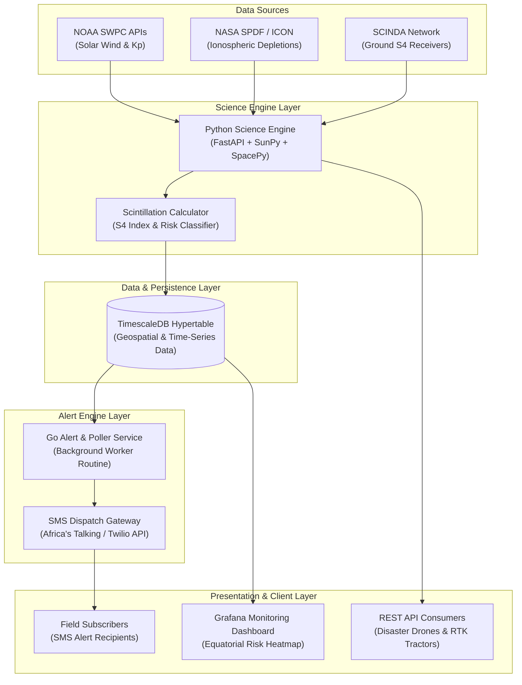
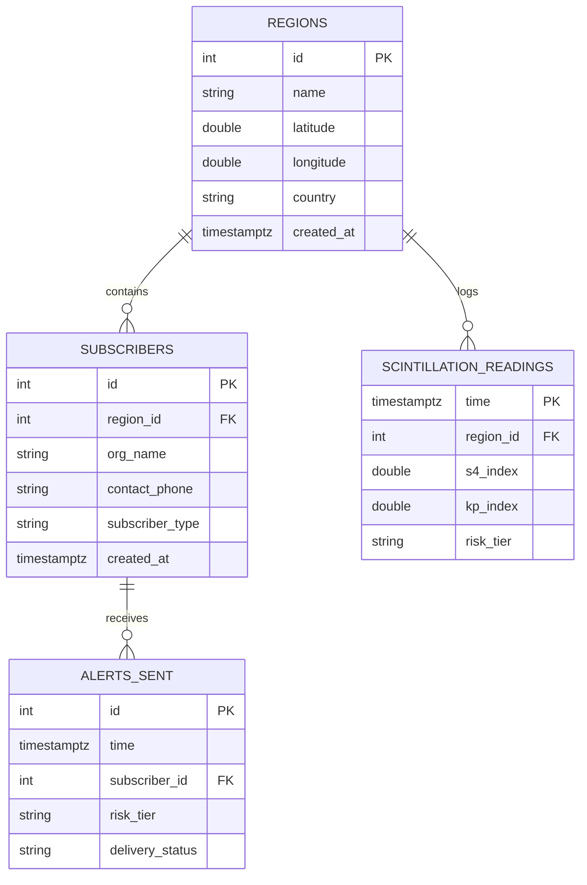
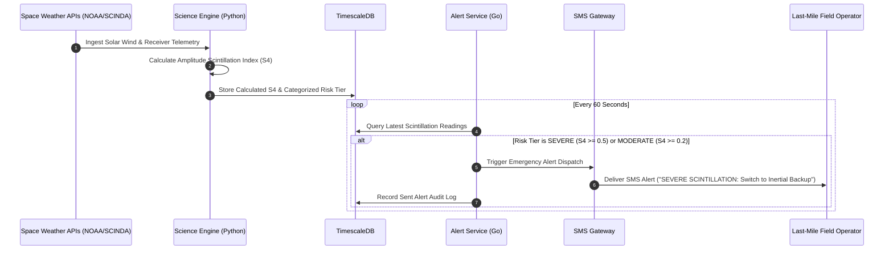

# PRISM — Refracting Space-Weather Complexity into Equatorial Clarity

> **Planetary Scintillation & Ionospheric Risk Indicator System**  
> *Track:* Astronomy + Tech | *Event:* CSH Social Impact Ideathon 2026

[](LICENSE)
[](#)
[](services/science-engine)
[](services/alert-service)
[](db/migrations)
[](infra/docker-compose.yml)

---

## 🌟 Executive Summary & Vision

Following major solar flares and Coronal Mass Ejections (CMEs), Earth's upper atmosphere experiences intense electromagnetic turbulence. Near the magnetic equator, post-sunset solar dynamics trigger massive plasma depletions known as **Equatorial Plasma Bubbles (EPBs)**. These bubbles diffract satellite signals passing through the ionosphere—a phenomenon known as **ionospheric scintillation**.

While space-faring nations monitor macro space weather for orbital assets, developing equatorial regions—spanning Sub-Saharan Africa, Southeast Asia, and Latin America—lack localized, actionable space-weather intelligence. In these regions, precision GNSS/GPS is critical for disaster search-and-rescue (SAR), precision agriculture, autonomous drone delivery, and regional aviation.

**PRISM** continuously ingests open space-weather telemetry (NOAA SWPC, NASA ICON, SCINDA), computes localized **Amplitude Scintillation ($S_4$)** indices, and refracts complex data into clear, 3-tier risk warnings dispatched via low-bandwidth SMS alerts and high-availability REST APIs.

---

## 🏗️ System Architecture

PRISM is designed as a decoupled, resilient microservices architecture capable of operating in low-connectivity environments.



---

## 🗄️ Database Entity-Relationship (ER) Diagram

PRISM leverages TimescaleDB for continuous time-series logging of scintillation telemetry and relational tracking of field subscribers.



---

## 🔄 End-to-End Data Flow Sequence



---

## 🔬 Core Space Physics & Risk Modeling

PRISM evaluates ionospheric health using the **Amplitude Scintillation Index ($S_4$)**:

$$S_4 = \sqrt{\frac{\langle I^2 \rangle - \langle I \rangle^2}{\langle I \rangle^2}}$$

Where $I$ is the received GNSS signal intensity over a 60-second sampling interval.

| Risk Tier | $S_4$ Index Range | Ionospheric Condition | Operational Impact & Guidance |
| :--- | :--- | :--- | :--- |
| **🟢 LOW** | $S_4 < 0.2$ | Quiet Ionosphere | Nominal GNSS operations. Sub-meter RTK accuracy. |
| **🟡 MODERATE** | $0.2 \le S_4 < 0.5$ | Mild Depletion | Minor cycle slips expected. Recommend dual-frequency fallback. |
| **🔴 SEVERE** | $S_4 \ge 0.5$ | Heavy Scintillation / EPB | High probability of total carrier lock loss. **Switch to Inertial Navigation (INS)**. |

---

## ⚔️ PRISM vs. Existing Solutions

| Feature | NOAA / SWPC Alerts | Standard IRI Model | PRISM (Our Solution) |
| :--- | :--- | :--- | :--- |
| **Focus Area** | Global / High Latitudes | Monthly Climatology | **Equatorial Belt ($S_4$ Specific)** |
| **Resolution** | Planetary Scale ($K_p$) | Climatological Average | **Hyper-localized Regional Nowcasting** |
| **Last-Mile Access** | Web Portals / Emails | Offline Code Library | **Low-Bandwidth SMS + REST API** |
| **Target Audience** | Satellite Operators | Academic Researchers | **Disaster SAR Drones & RTK Agriculture** |
| **Alert Latency** | Hours (Manual Bulletins) | Static Predictions | **Sub-Minute Automated Polling** |

---

## 👥 Beneficiary Impact & Social Use Cases

```
                                  [PRISM Core]
                                       │
         ┌─────────────────────────────┼─────────────────────────────┐
         ▼                             ▼                             ▼
  [Disaster Search & Rescue]   [Precision Agriculture]       [Regional Aviation/Maritime]
  • Drones maintain INS fallback • Prevents RTK tractor drift  • Real-time equatorial risk
  • Protects coastal SAR teams  • Saves crop damage & downtime • Prevents GNSS blindspots
```

1. **Disaster Search & Rescue (SAR):** Prevents autonomous rescue drones from losing signal during nocturnal search operations in equatorial flood zones.
2. **Precision Agriculture:** Alerts farmers in East Africa and South America before phase scintillation corrupts Real-Time Kinematic (RTK) automated tractor navigation.
3. **Regional Aviation & Maritime:** Supplies port authorities and regional airfields with real-time ionospheric health dashboards.

---

## 📡 REST API Reference

The Science Engine exposes RESTful endpoints for real-time risk assessment and AI predictive forecasting:

| Endpoint | Method | Query Parameters | Description |
| :--- | :--- | :--- | :--- |
| `/health` | `GET` | None | Engine status & uptime check |
| `/risk` | `GET` | `latitude` (float), `longitude` (float) | Computes real-time $S_4$ index and risk tier |
| `/forecast` | `GET` | `latitude` (float), `longitude` (float) | **AI ML 3-Hour Predictive Scintillation Trajectory** with 95% CI |
| `/telemetry/live` | `GET` | None | Live ingested solar wind & geomagnetic telemetry |
| `/simulate/storm` | `GET` | `latitude` (float), `longitude` (float) | Full 6-hour Coronal Mass Ejection (CME) storm simulation |

### Sample AI Forecast Response (`GET /forecast?latitude=-1.2921&longitude=36.8219`)

```json
{
  "location": { "latitude": -1.2921, "longitude": 36.8219 },
  "current_s4": 0.78,
  "current_kp": 7.33,
  "forecast_horizons": [
    { "lead_time_hours": 1, "predicted_s4": 0.99, "predicted_risk_tier": "SEVERE", "warning_flag": true },
    { "lead_time_hours": 2, "predicted_s4": 1.00, "predicted_risk_tier": "SEVERE", "warning_flag": true },
    { "lead_time_hours": 3, "predicted_s4": 0.96, "predicted_risk_tier": "SEVERE", "warning_flag": true }
  ],
  "epb_formation_probability_percent": 65.5,
  "primary_instability_driver": "Geomagnetic Storm Triggered (Southward IMF Bz Coupling)",
  "actionable_guidance": "⚠️ HIGH RISK ALERT: S4 predicted to exceed 0.50 within 1–3 hours. Prepare to switch autonomous drones and RTK tractor systems to Inertial Navigation (INS) backup."
}
```

---

## ⚡ Quick Demo (Interactive Storm Simulation)

Run the end-to-end CME solar storm simulation and AI predictive forecast directly in your terminal with zero configuration:

```bash
# Clone the repository & run the interactive simulator
git clone https://github.com/AdeshDeshmukh/prism.git
cd prism
python demo_storm.py
```

---

## 🚀 Full Stack Deployment (Docker Compose)

Run the full PRISM microservices stack locally (Science Engine, Go Alert Poller, TimescaleDB, Grafana):

```bash
docker-compose -f infra/docker-compose.yml up --build
```

### Microservice Access Points
* **Science Engine API (FastAPI Swagger UI):** `http://localhost:8000/docs`
* **Grafana Monitoring Dashboard:** `http://localhost:3000` (Credentials: `admin`/`admin`)
* **TimescaleDB Time-Series Engine:** `localhost:5432` (`prism_db`)

---

## 🗺️ Project Implementation Roadmap

- [x] **Phase 1: Science & Data Pipeline** — Integrated NOAA SWPC & SCINDA telemetry models; implemented $S_4$ index scoring equation.
- [x] **Phase 2: Microservices Engine** — Engineered Python FastAPI engine, Go polling/alerting service, and TimescaleDB hypertable migrations.
- [x] **Phase 3: Containerization & Dashboard** — Built multi-container Docker Compose spec and Grafana risk heatmap provisioning.
- [ ] **Phase 4: Ground Receiver Pilot (Q4 2026)** — Deploy open receiver stations with partner universities in Kenya and Brazil.
- [ ] **Phase 5: Predictive Machine Learning (Q1 2027)** — Train LSTM networks to predict plasma bubble drift trajectories 3 hours in advance.

---

## 📜 Data Attributions

PRISM relies on open science data made publicly available by:
* **NOAA Space Weather Prediction Center (SWPC)** — Real-time solar wind & geomagnetic indices ($K_p$).
* **NASA Space Physics Data Facility (SPDF)** — NASA ICON & GOLD satellite ionospheric depletion datasets.
* **SCINDA / IGS Network** — Equatorial ground receiver scintillation metrics.

---

## 📄 License

Distributed under the [MIT License](LICENSE). Copyright © 2026 PRISM Contributors.
