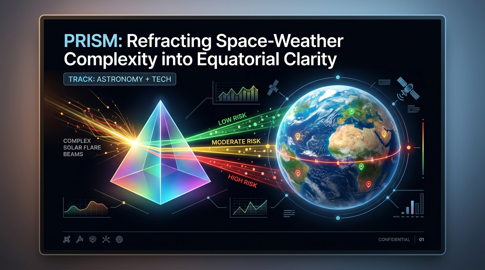
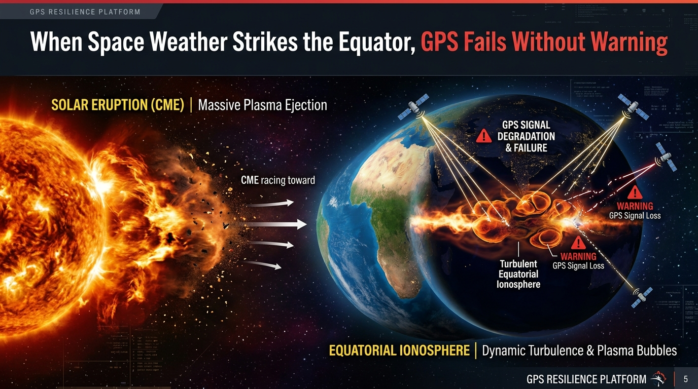
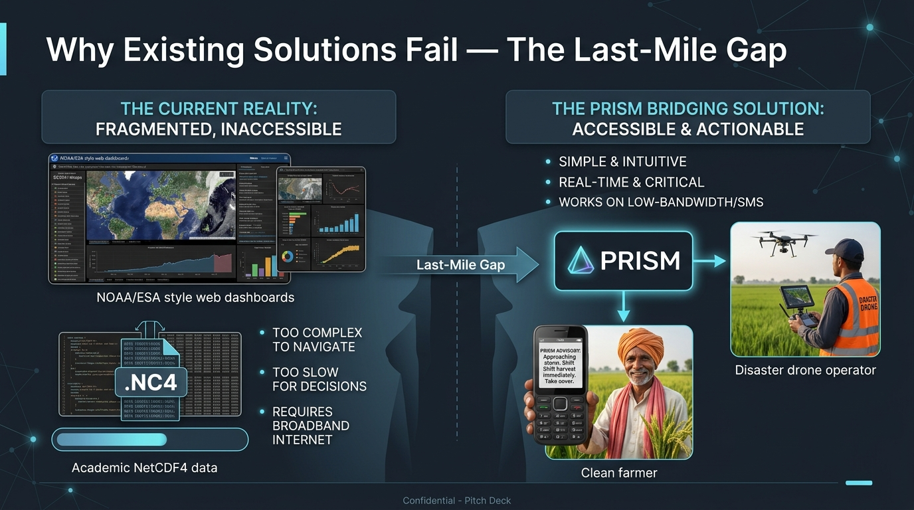
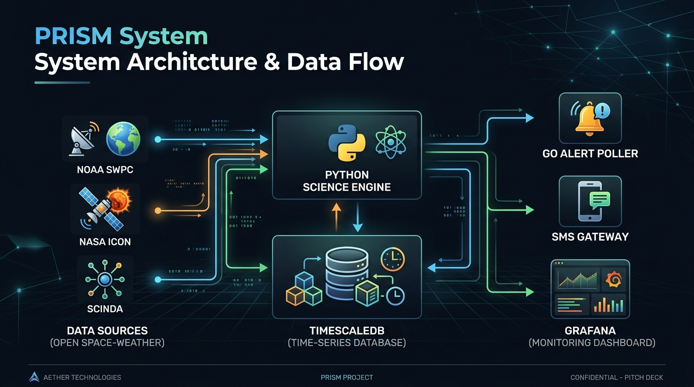
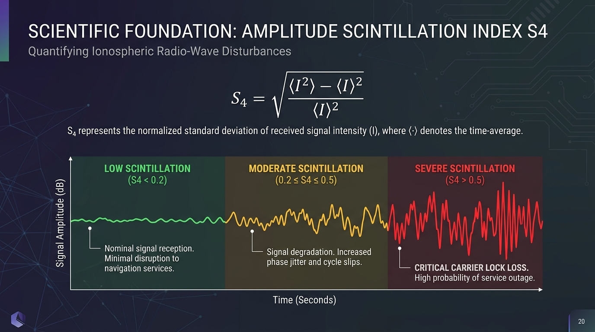
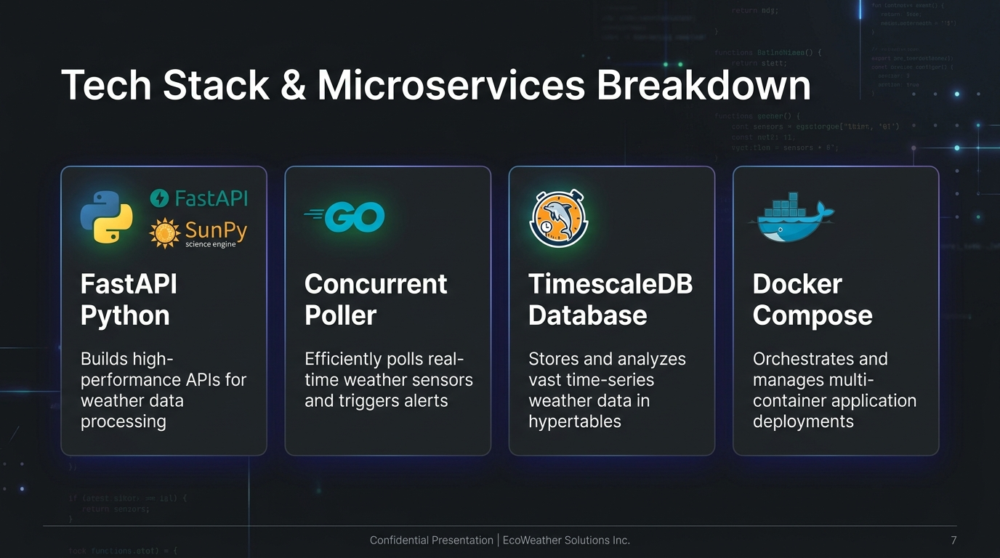
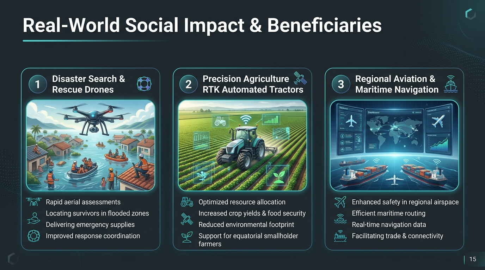
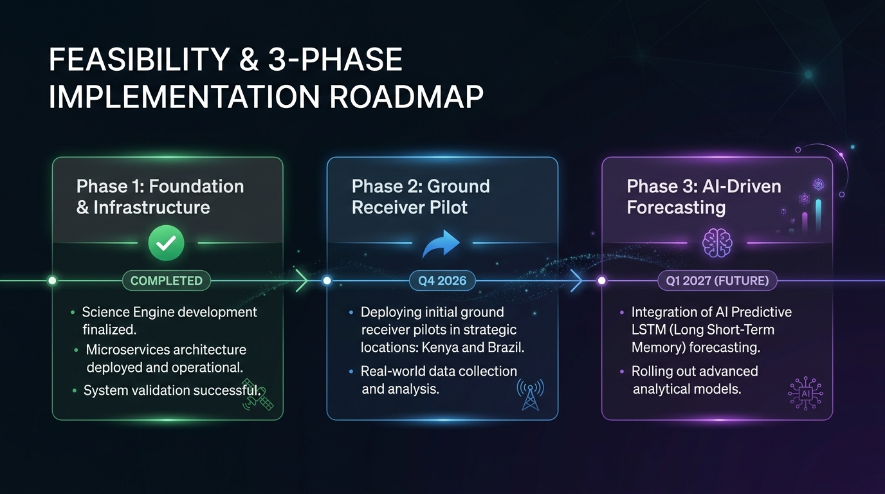
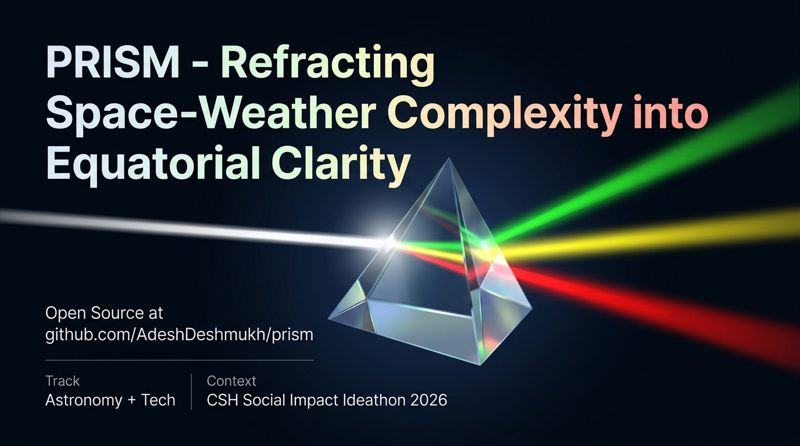

# PRISM — Official Pitch Deck Presentation
**Track:** Astronomy + Tech | **Hackathon:** CSH Social Impact Ideathon 2026

---

## Slide 1: Title & Vision

* **Title:** PRISM — Refracting Space-Weather Complexity into Equatorial Clarity
* **Subtitle:** Planetary Scintillation & Ionospheric Risk Indicator System
* **Track:** Astronomy + Tech
* **Vision:** Democratizing real-time space-weather early warnings for developing nations in equatorial belts.

---

## Slide 2: The Hook & Real-World Problem

* **Headline:** *"When Space Weather Strikes the Equator, GPS Fails Without Warning."*
* **The Problem:** Following solar flares, post-sunset **Equatorial Plasma Bubbles (EPBs)** form via Rayleigh-Taylor instabilities in the ionosphere (200–500 km altitude).
* **The Impact:** Signals diffract, causing **ionospheric scintillation**. GPS positioning accuracy drops from 1 meter to over 30 meters or suffers total loss of carrier lock.
* **Who Suffers:** Disaster rescue drones, precision agriculture tractors, and regional coastal vessels in the equatorial belt.

---

## Slide 3: The Gap — Why Existing Solutions Fail

* **Planetary Focus vs. Regional Reality:** NOAA SWPC and ESA monitor global planetary storms ($K_p \ge 7$), but do not provide hyper-localized equatorial plasma bubble warnings.
* **Academic Complexity:** Tools like IRI output raw NetCDF4 files meant for astrophysicists — impossible for field workers to interpret.
* **Connectivity Blindspot:** Existing dashboards require stable broadband. Rural equatorial zones need low-bandwidth SMS alerts on basic feature phones.

---

## Slide 4: The Solution — PRISM Architecture

* **Ingestion:** Open space-weather APIs (NOAA SWPC solar wind, NASA ICON/GOLD, SCINDA ground stations).
* **Science Engine:** Python FastAPI engine calculating real-time Amplitude Scintillation ($S_4$) index.
* **Storage:** TimescaleDB time-series hypertables logging geospatial readings.
* **Alert Poller:** High-throughput Go service dispatching automated SMS warnings.
* **Dashboard:** Provisioned Grafana risk heatmap.

---

## Slide 5: Scientific Foundation — $S_4$ Scintillation Modeling

* **Mathematical Model:**
$$S_4 = \sqrt{\frac{\langle I^2 \rangle - \langle I \rangle^2}{\langle I \rangle^2}}$$
* **Operational Risk Tiers:**
  * 🟢 **LOW ($S_4 < 0.2$):** Nominal GNSS precision.
  * 🟡 **MODERATE ($0.2 \le S_4 < 0.5$):** Mild signal degradation; minor cycle slips.
  * 🔴 **SEVERE ($S_4 \ge 0.5$):** Heavy scintillation; carrier lock loss. **Switch to INS backup.**

---

## Slide 6: Tech Stack & Microservices Breakdown

* **Python Science Engine (`services/science-engine`):** FastAPI + SunPy + SpacePy. Ingests NOAA/SCINDA telemetry, computes $S_4$ risk scores, exposes REST API.
* **Go Alert Engine (`services/alert-service`):** Concurrent background poller querying TimescaleDB every 60s and dispatching SMS alerts.
* **TimescaleDB (`db/migrations`):** Hypertable partitioning strategy for fast geospatial time-series indexing.
* **Docker Compose (`infra/docker-compose.yml`):** Single-command multi-container deployment.

---

## Slide 7: Real-World Social Impact & Beneficiaries

1. **Disaster Search & Rescue (SAR) Drones:** Prevents crashes during flood/earthquake night searches by alerting operators to activate INS backup before mission launch.
2. **Precision Agriculture:** Protects RTK tractor guidance from losing carrier phase lock, preventing crop damage across East Africa and South America.
3. **Regional Aviation & Maritime:** Supplies port authorities and airfield dispatchers with a real-time ionospheric health REST API.

---

## Slide 8: Feasibility & 3-Phase Implementation Roadmap

* ✅ **Phase 1: Science Engine & Microservices (Completed):** Full monorepo codebase — Python FastAPI, Go poller, TimescaleDB, Docker Compose, Grafana dashboard.
* 🔵 **Phase 2: Ground Receiver Pilot (Q4 2026):** 10 dual-frequency receivers at partner universities in Nairobi, Kenya & Natal, Brazil. ($15,000 pilot budget — eligible for ITU Digital Innovation Fund or Google.org Impact Challenge.)
* 🔮 **Phase 3: AI Predictive Forecasting (Q1 2027):** LSTM networks to forecast EPB drift trajectories 1–3 hours ahead.

---

## Slide 9: Conclusion & Call to Action

* **Open Source Repository:** [github.com/AdeshDeshmukh/prism](https://github.com/AdeshDeshmukh/prism)
* **Track:** Astronomy + Tech
* **Event:** CSH Social Impact Ideathon 2026
* **Tagline:** *"Refracting space-weather complexity into equatorial clarity."*
